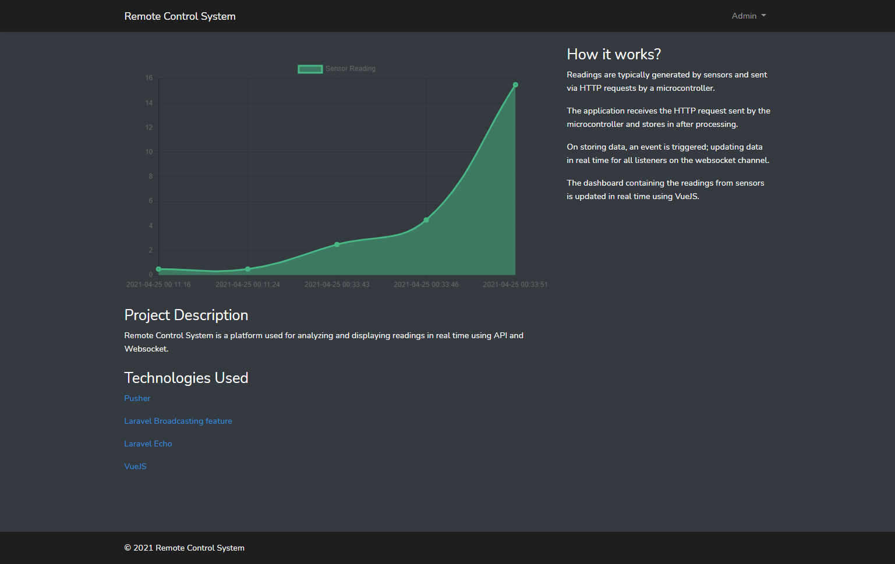

## Remote Control System

Remote Control System is a platform used for analyzing and displaying readings in real time using API and Websocket.

## How it works?
- Readings are typically generated by sensors and sent via HTTP requests by a microcontroller.
- The application receives the HTTP request sent by the microcontroller and stores in after processing.
- On storing data, an event is triggered; updating data in real time for all listeners on the websocket channel.
- The dashboard containing the readings from sensors is updated in real time using VueJS.

## Technologies Used
- [Pusher](https://pusher.com/) 
- [Laravel Broadcasting feature](https://laravel.com/docs/8.x/broadcasting)
- [Laravel Echo](https://laravel.com/docs/8.x/broadcasting#client-pusher-channels)
- [VueJS](https://vuejs.org/) 

## Screenshots

